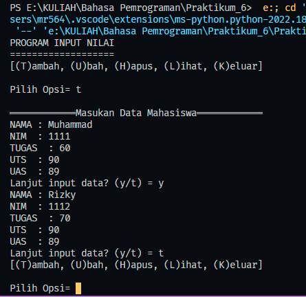

# Tugas Python Pertemuan 11
___
Nama    : Muhammad Rizky<br>
NIM     : 312210576<br>
Kelas   : TI.22.B2<br>
Mapel   : Bahasa Pemrograman<br>

**Daftar isi**
> * [Latihan Module 1](#latihan-module-1)
> * [Tugas Praktikum](#tugas-praktikum)

# `Latihan Module 1`
<br>

### Script
```python
    import math

    # def a(x):
    #     return x**2
    a = (lambda x: x**2)
    print(a(4))

    # def b(x, y):
    #     return math.sqrt(x**2 + y**2)
    b = (lambda x,y: math.sqrt(x**2 + y**2))
    print((4,4))

    # def c(*args):
    #     return sum(args)/len(args)
    c = (lambda *args: sum(args)/len(args))
    print(c(4,4,4))

    # def d(s):
    #     return "".join(set(s))
    d = (lambda s: "".join(set(s)))
    print(d("Latihan1"))
```


# `Tugas Praktikum`


## `Flowchart`

## `Code`


## `Hasil`
### Menambahkan Data

### Melihat data

### Mengubah Data

### Menghapus Data


### Terimakasih...